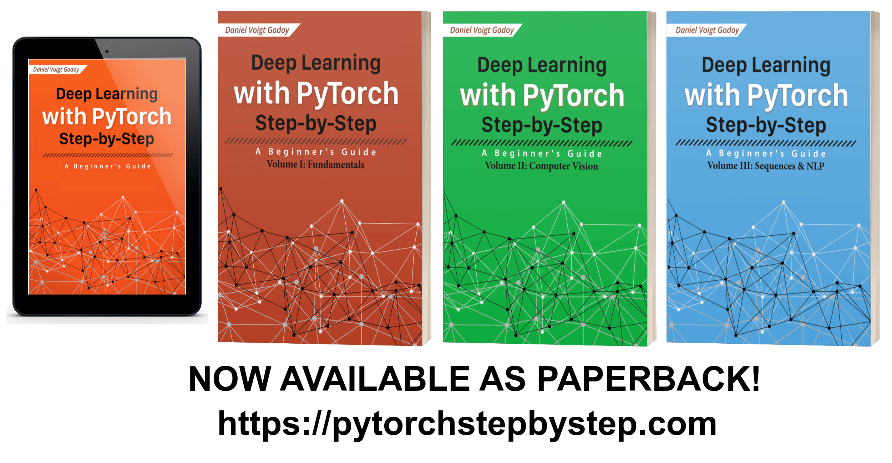

# Deep Learning with PyTorch Step-by-Step

This is the official repository of my book "**Deep Learning with PyTorch Step-by-Step**". Here you will find **one Jupyter notebook** for every **chapter** in the book.

Each notebook contains **all the code shown** in its corresponding chapter, and you should be able to
**run its cells in sequence** to get the **same outputs as shown in the book**. I strongly believe that being able to **reproduce the results** brings **confidence** to the reader.

There are **three** options for you to run the Jupyter notebooks:

### Google Colab

You can easily **load the notebooks directly from GitHub** using Colab and run them using a **GPU** provided by Google. You need to be logged in a Google Account of your own.

You can go through the chapters already using the links below:

#### Part I - Fundamentals

- [Chapter 0 - Visualizing Gradient Descent](https://colab.research.google.com/github/dvgodoy/PyTorchStepByStep/blob/master/Chapter00.ipynb)
- [Chapter 1 - A Simple Regression Problem](https://colab.research.google.com/github/dvgodoy/PyTorchStepByStep/blob/master/Chapter01.ipynb)
- [Chapter 2 - Rethinking the Training Loop](https://colab.research.google.com/github/dvgodoy/PyTorchStepByStep/blob/master/Chapter02.ipynb)
- [Chapter 2.1 - Going Classy](https://colab.research.google.com/github/dvgodoy/PyTorchStepByStep/blob/master/Chapter02.1.ipynb)
- [Chapter 3 - A Simple Classification Problem](https://colab.research.google.com/github/dvgodoy/PyTorchStepByStep/blob/master/Chapter03.ipynb)

#### Part II - Computer Vision

- [Chapter 4 - Classifying Images](https://colab.research.google.com/github/dvgodoy/PyTorchStepByStep/blob/master/Chapter04.ipynb)
- [Chapter 5 - Convolutions](https://colab.research.google.com/github/dvgodoy/PyTorchStepByStep/blob/master/Chapter05.ipynb)
- [Chapter 6 - Rock, Paper, Scissors](https://colab.research.google.com/github/dvgodoy/PyTorchStepByStep/blob/master/Chapter06.ipynb)
- [Chapter 7 - Transfer Learning](https://colab.research.google.com/github/dvgodoy/PyTorchStepByStep/blob/master/Chapter07.ipynb)
- [Extra Chapter - Vanishing and Exploding Gradients](https://colab.research.google.com/github/dvgodoy/PyTorchStepByStep/blob/master/ChapterExtra.ipynb)

#### Part III - Sequences

- [Chapter 8 - Sequences](https://colab.research.google.com/github/dvgodoy/PyTorchStepByStep/blob/master/Chapter08.ipynb)
- [Chapter 9 - Sequence-to-Sequence](https://colab.research.google.com/github/dvgodoy/PyTorchStepByStep/blob/master/Chapter09.ipynb)
- [Chapter 10 - Transform and Roll Out](https://colab.research.google.com/github/dvgodoy/PyTorchStepByStep/blob/master/Chapter10.ipynb)

#### Part IV - Natural Language Processing

- [Chapter 11 - Down the Yellow Brick Rabbit Hole](https://colab.research.google.com/github/dvgodoy/PyTorchStepByStep/blob/master/Chapter11.ipynb)

### Binder

You can also **load the notebooks directly from GitHub** using Binder, but the process is slightly different. It will create an environment on the cloud and allow you to access **Jupyter's Home Page** in your browser, listing all available notebooks, just like in your own computer.

If you **make changes** to the notebooks, **make sure to download** them, since Binder **does not keep the changes** once you close it.

You can start your environment on the cloud right now using the button below:

### Local Installation

This option will give you more **flexibility**, but it will require **more effort to set up**. I encourage you to try setting up your own environment. It may seem daunting at first, but you can surely accomplish it following **seven easy steps**:

**1 - Anaconda**

If you don’t have [**Anaconda’s Individual Edition**](https://www.anaconda.com/products/individual) installed yet, that would be a good time to do it - it is a very handy way to start - since it contains most of the Python libraries a data scientist will ever need to develop and train models. 

Please follow **the installation instructions** for your OS:

- [Windows](https://docs.anaconda.com/anaconda/install/windows/)
- [macOS](https://docs.anaconda.com/anaconda/install/mac-os/)
- [Linux](https://docs.anaconda.com/anaconda/install/linux/)

Make sure you choose **Python 3.X** version since Python 2 was discontinued in January 2020.

**2 - Conda (Virtual) Environments**

Virtual environments are a convenient way to isolate Python installations associated with different projects.

First, you need to choose a **name** for your environment :-) Let’s call ours `pytorchbook` (or anything else you find easier to remember). Then, you need to open a **terminal** (in Ubuntu) or **Anaconda Prompt** (in Windows or macOS) and type the following command:

`conda create -n pytorchbook anaconda`

The command above creates a conda environment named `pytorchbook` and includes **all anaconda packages** in it (time to get a coffee, it will take a while...). If you want to learn more about creating and using conda environments, please check Anaconda’s [**Managing Environments**](https://docs.conda.io/projects/conda/en/latest/user-guide/tasks/manage-environments.html) user guide.

Did it finish creating the environment? Good! It is time to **activate it**, meaning, making that Python installation the one to be used now. In the same terminal (or Anaconda Prompt), just type:

`conda activate pytorchbook`

Your prompt should look like this (if you’re using Linux)...

`(pytorchbook)$`

or like this (if you’re using Windows):

`(pytorchbook)C:\>`

Done! You are using a **brand new conda environment** now. You’ll need to **activate it** every time you open a new terminal or, if you’re a Windows or macOS user, you can open the corresponding Anaconda Prompt (it will show up as **Anaconda Prompt (pytorchbook)**, in our case), which will have it activated from start.

**IMPORTANT**: From now on, I am assuming you’ll activate the `pytorchbook` environment every time you open a terminal / Anaconda Prompt. Further installation steps **must** be executed inside the environment.

**3 - PyTorch**

It is time to install the star of the show :-) We can go straight to the [**Start Locally**](https://pytorch.org/get-started/locally/) section of its website and it will automatically select the options that best suit your local environment and it will show you the command to run.

Your choices should look like:

- PyTorch Build: "Stable"
- Your OS: your operating system
- Package: "Conda"
- Language: "Python"
- CUDA: "None" if you **don't** have a **GPU**, or the latest version (e.g. "10.1"), if you **have** a **GPU**.

The installation command will be shown right below your choices, so you can copy it. If you have a **Windows** computer and **no GPU**, you'd have to run the following command in your **Anaconda Prompt (pytorchbook)**:

`(pytorchbook) C:\> conda install pytorch torchvision cpuonly -c pytorch`

**4 - TensorBoard**

TensorBoard is a powerful tool and we can use it even if we are developing models in PyTorch. Luckily, you don’t need to install the whole TensorFlow to get it, you can easily **install TensorBoard alone** using **conda**. You just need to run this command in your **terminal** or **Anaconda Prompt** (again, after activating the environment):

`(pytorchbook)C:\> conda install -c conda-forge tensorboard`

**5 - GraphViz and TorchViz (optional)**

> This step is optional, mostly because the installation of GraphViz can be challenging sometimes (especially on Windows). If, for any reason, you do not succeed in installing it correctly, or if you
> decide to skip this installation step, you will still be **able to execute the code in this book** (except for a couple of cells that generate images of a model’s structure in the Dynamic Computation Graph section of Chapter 1).

We need to install GraphViz to be able to use **TorchViz**, a neat package that allows us to visualize a  model’s structure. Please check the [**installation instructions**]( https://www.graphviz.org/download/) for your OS. 

> If you are using **Windows**, please use the installer at [GraphViz's Windows Package](https://graphviz.gitlab.io/_pages/Download/windows/graphviz-2.38.msi). You also need to  add GraphViz to the PATH (environment variable) in Windows. Most likely, you can find GraphViz executable file at `C:\ProgramFiles(x86)\Graphviz2.38\bin`. Once you found it, you need to set or change the PATH accordingly, adding GraphViz's location to it. For more details on how to do that, please refer to [How to Add to Windows PATH Environment Variable](https://bit.ly/3fIwYA5).

For additional information, you can also check the [How to Install Graphviz Software](https://bit.ly/30Ayct3) guide. 

If you installed GraphViz successfully, you can install the [torchviz](https://github.com/szagoruyko/pytorchviz) package. This package is not part of Anaconda Distribution Repository and is only available at PyPI , the Python Package Index, so we need to pip install it.

Once again, open a **terminal** or **Anaconda Prompt** and run this command (just once
more: after activating the environment):

`(pytorchbook)C:\> pip install torchviz`

**6 - Git**

It is way beyond the scope of this guide to introduce you to version control and its most popular tool: `git`. If you are familiar with it already, great, you can skip this section altogether!

Otherwise, I’d recommend you to learn more about it, it will **definitely** be useful for you later down the line. In the meantime, I will show you the bare minimum, so you can use `git` to **clone this repository** containing all code used in this book - so you have your own, local copy of it and can modify and experiment with it as you please.

First, you need to install it. So, head to its [downloads](https://git-scm.com/downloads) page and follow instructions for your OS. Once installation is complete, please open a **new terminal** or **Anaconda Prompt** (it's OK to close the previous one). In the new terminal or Anaconda Prompt, you should be able to **run `git` commands**. To clone this repository, you only need to run:

`(pytorchbook)C:\> git clone https://github.com/dvgodoy/PyTorchStepByStep.git`

The command above will create a `PyTorchStepByStep` folder which contains a **local copy** of everything available on this GitHub’s repository.

**7 - Jupyter**

After cloning the repository, navigate to the `PyTorchStepByStep` and, **once inside it**, you only need to **start Jupyter** on your terminal or Anaconda Prompt:

`(pytorchbook)C:\> jupyter notebook`

This will open your browser up and you will see **Jupyter's Home Page** containing this repository's notebooks and code.

Congratulations! You are ready to go through the chapters' notebooks!

